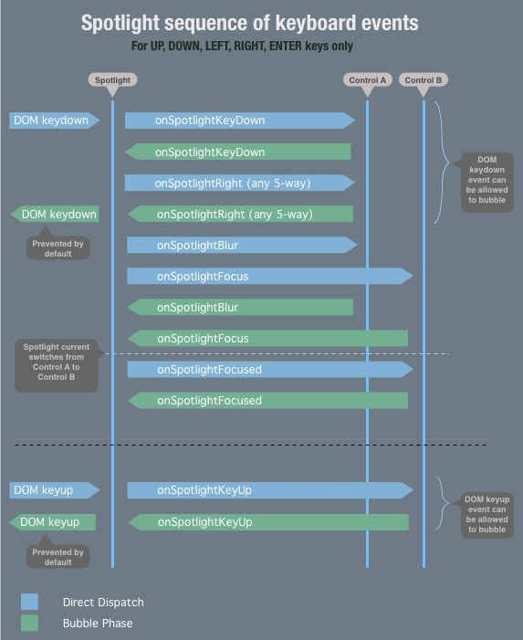
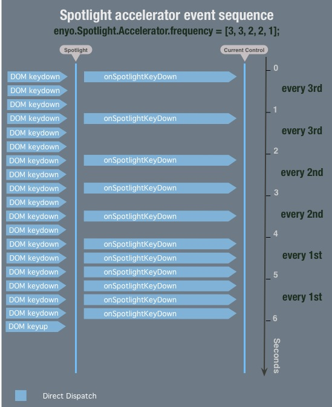

# SPOTLIGHT DOCUMENTATION #

1. [What is Spotlight?](#1)
2. [Modes](#2)
3. [Navigation](#3)
4. [Containers](#4)
5. [Nesting](#5)
6. [Events](#6)
	1. [Spotlight events list](#6_1)
	2. [Preventing/Allowing default DOM events](#6_2)
	3. [Sequence of Spotlight events](#6_3)
	4. [Accelerated keydown events](#6_4)
7. [Extending Spotlight](#7)
	1. [Spotlight Decorators](#7.1)
	2. [Extending controls](#7.2)

## 1. WHAT IS SPOTLIGHT? ##

Spotlight is an extensible utility that enables users to navigate Enyo
applications using a keyboard or television remote control.  Responding to input
from the **UP**, **DOWN**, **LEFT**, **RIGHT**, and **RETURN** keys, Spotlight
provides a navigation experience that compares favorably to that of a mouse on a
computer.

In addition, Spotlight includes support for Point-and-Click events, so all bases
are covered.

To add **[Spotlight](kind.Spotlight.js)** to an application, simply include the
`Spotlight` package in your `package.js` file and add a Spotlight control as a
top-level component in the app kind:

    enyo.kind({
        name: 'App',
        kind: 'FittableRows',   
        components:[   
            {kind: 'enyo.Spotlight', defaultControl: 'list1'},
            ...
        ],
        ...
    });

## 2. MODES ##

Spotlight operates in two mutually exclusive modes: **5-way mode** and **Pointer
mode**.  By default, it is configured to switch between these modes whenever
suitable input is received--i.e., it switches to pointer mode on `mousemove`,
and back to 5-way mode on `keydown`.

The Spotlight API also provides a way to explicitly perform the switch:

    `Enyo.Spotlight.setPointerMode([BOOLEAN]);`

## 3. NAVIGATION ##

**[Spotlight](kind.Spotlight.js)** allows navigation between Enyo controls by
assigning focus to one control at a time.  When a control is focused, it takes
on the CSS class `.spotlight`, which allows focused controls to be styled on a
per-kind basis using `.<kindClass>.spotlight` selectors.

In order to make a control focusable (or **"spottable"**) with Spotlight, simply
set its `spotlight` property to `TRUE`, like so:

    {name: 'mybutton', tag: 'button', spotlight: true}
	
When the application loads, Spotlight searches for a control with the name
specified in its `defaultControl` property; if `defaultControl` is not
specified, Spotlight assigns focus to the first available spottable control.

In 5-way mode, Spotlight uses the
[Nearest Neighbor Algorithm](kind.Spotlight.NearestNeighbor.js) to determine
which spottable control is the nearest in the direction of navigation.  The
coordinates of a spottable control are derived from its actual position on the
screen.

It's worth noting that spottable controls may be found on different hierarchical
levels of an Enyo component tree.  Spotlight facilitates seamless navigation
between the topmost spottable components found in the tree.

## 4. CONTAINERS ##

In order to organize controls into navigation groups, we have created Spotlight
containers. 

A good example use case for containers is a set of radio buttons that must be
navigable separate from the rest of the app's controls.

When a Spotlight container is focused, it passes the focus to its own hierarchy
of spottable child controls--namely, to the last spottable child to hold focus
before the focus moved outside of the container.  If the container in question
has never been focused, it passes focus to its first spottable child.

To define a container, set a control's `spotlight` property to `"container"`:

    {name: 'mycontainer', spotlight: 'container', components: [<A LIST OF spotlight:true CONTROLS>]}

In a way, containers may be thought of as the branches--and `spotlight:true`
controls as the leaves--of the Spotlight navigation tree.

## 5. NESTING ##

Spotlight containers may be nested.  The inner containers may be remembered as
"last focused children" of the outer ones; they act as conduits of focus passed
by the outer containers.

We have not found it useful to nest `spotlight:true` controls.  For now, these
controls act as the leaves of the spottable tree and do not conduct focus;
however, this behavior may be overridden on a per-control basis.

## 6. EVENTS ##

All spotlight events are dispatched directly to the currently spotted control, where they can be prevented from bubbling to define custom behavior. (See [Extending Spotlight](#7) section)
If spotlight events are allowed to bubble to the application level, the **[Spotlight](kind.Spotlight.js)** responds to them with default behavior.

 

### 6.1. Spotlight events list ###

The events dispatched by main **[Spotlight](kind.Spotlight.js)** module are:
> ### 5-way mode: ###
>
> 1. **onSpotlightKeyDown** - dispatched in response to keydown
>
> 2. **onSpotlightKeyUp** - dispatched in response to keyup
> 
> 3. **onSpotlightLeft** - dispatched in response to onSpotlightKeyDown bubble to app level with keyCode 37
> 
> 4. **onSpotlightRight** - dispatched in response to onSpotlightKeyDown bubble to app level with keyCode 39
> 
> 5. **onSpotlightUp** - dispatched in response to onSpotlightKeyDown bubble to app level with keyCode 38
> 
> 6. **onSpotlightDown** - dispatched in response to onSpotlightKeyDown bubble to app level with keyCode 40
> 
> 7. **onSpotlightSelect** - dispatched in response to onSpotlightKeyDown bubble to app level with keyCode 13
> 
> 8. **onSpotlightFocus** - dispatched when focus is being transferred to new control in response to events 3-8
> 
> 9. **onSpotlightBlur** - dispatched when focus is transferred away from a control
> 
> 10. **onSpotlightFocused** - dispatched in response to onSpotlightFocus bubble to app level right after it's originator is set as current
>
> ### Pointer mode: ###
>
> 1. **onSpotlightPoint** - dispatched in response to mousemove with coordinates matching bounds of spottable control
>
> 2. **onSpotlightScroll** - TBD    

      

### 6.2. Preventing/Allowing default DOM events ###

By default, if keydown event carries 5-way keyCode (13, 37, 38, 39 or 40), it is prevented from bubbling to trigger default browser behavior. 
This has been done to disable default browser scrolling, because in presence of **[Spotlight](kind.Spotlight.js)**, scrolling is handled otherwise using components like Scroller.
Of course, there are other cases where you may want the default behavior to happen. 
For example, in text inputs, moving cursor to the next character when right arrow key is depressed, may not require interference from JavaScript. 

For cases like that, there is a **Allow DOM default** feature.
Events **onSpotlightKeyDown**, **onSpotlightLeft**, **onSpotlightRight**, **onSpotlightUp**, **onSpotlightDown** and **onSpotlightSelect** supply to their handlers an event with added `allowDomDefault` method:

>	`onSpotlightKeyDown: function(oSender, oEvent) {`   
>	&nbsp;&nbsp;&nbsp;&nbsp;`oEvent.allowDomDefault();`   
>	`}`

If the above handler, if the spotlight event is allowed to propagate, it will allow the original DOM keydown to trigger default browser behavior. See [Figure A](#A).   
   

### 6.3. Sequence of Spotlight events ###

Figure A
--------

Following [Figure A](#A), **[Spotlight](kind.Spotlight.js)** 5-way mode events are following a sequence each step of which can be modified/prevented on the currently focused control level (See [Extending Spotlight](#7) section).

For an instance, when `onSpotlightKeyDown` is dispatched to focused control, the control has a choice to prevent it from ever reaching the App level where it would be handled by **[Spotlight](kind.Spotlight.js)**, and replace the default behavior with custom.

If, however, `onSpotlightKeydown` is allowed to propagate and the **[Spotlight](kind.Spotlight.js)** recognizes it's keyCode as one of 5-way key codes, it dispatches `onSpotlight<5-Way Direction>` event back to the focused control.
At this point, the control has, yet again, the option of overriding default behavior.

If `onSpotlight<5-Way Direction>` event bubbles up to App level, **[Spotlight](kind.Spotlight.js)** employs it's [Nearest Neighbor Algorithm](kind.Spotlight.NearestNeighbor.js) to figure out what spottable control is closest in the `<5-Way Direction>`. 
It dispatches `onSpotlightBlur` (while removing CSS *.spotlight* class) to the current control, and `onSpotlightFocus` to the neighbor in question (while adding CSS *.spotlight* class to it).

If `onSpotlightFocus` is allowed to bubble from the newly focused control, **[Spotlight](kind.Spotlight.js)** set's it's originator as **current**, and it officially becomes focused control. 
In celebration of this fact, **[Spotlight](kind.Spotlight.js)** dispatches `onSpotlightFocused` to the control.   

 

### 6.4. Accelerated keydown events ###

Figure B
--------

While key is depressed, browser dispatches keydown events with equal (or nearly equal) intervals.

Following [Figure B](#B), we can see that not all of them affect application.
Function of [Spotlight Accelerator](kind.Spotlight.Accelerator.js) is to distribute events in time per it's configuration.

[Spotlight Accelerator](kind.Spotlight.Accelerator.js) can be configured via it's array property `enyo.Spotlight.Accelerator.frequency`.
It's default configuration is:

> `//* Firing configuration. At n-th second use every frequency[n] subsequent keydown event`    
> frequency	: [3, 3, 3, 2, 2, 2, 1], ...   
 
This commands [Accelerator](kind.Spotlight.Accelerator.js) the following:

* On 1st, 2nd and 3rd second after key is depressed, only allow through every 3rd keydown event
* On 4th, 5th and 6th second - allow every 2nd keydown event
* On 7th and on second - allow every keydown event

This creates an appearance of Spotlight focus moving on the screen with acceleration while 5-way key is depressed.

## 7. EXTENDING SPOTLIGHT ##

There are two ways to extend spotlight functionality: using [Spotlight Decorators](#7.1) or [Extending existing controls](#7.2).

Each of the two has it's own pros and cons. Historically, we needed pros of both, so both were implemented.

 

### 7.1. Spotlight Decorators ###

Spotlight decorators is a way to add spotlight functionality to a control without altering it's code. 
This approach is useful when one or more of the following is true:

* You don't have access to alter control's code
* You prefer not to extend control
* You want to share same spotlight-related code among multiple kinds

 
**Steps to create and apply a decorator to a kind:**

1. Create a *`kind.Spotlight.Decorator.<My-Decorated-Kind>.js`* file  
2. Place this file into */decorators* folder inside of *spotlight* package
3. Add a line with your new filename to */decorators/package.js* file to create a dependency
4. In the file create a decorator kind:  
> `name: enyo.Spotlight.Decorator.<My-Decorated-Kind>,`  
5. Add `statics` block to write the rest of your code in it
6. Add static property *decorates* :   
> `decorates: My-Decorated-Kind,`  

7. Add event handler function with exactly the same name as a Spotlight event you wish to handle:
> `onSpotlightFocused: function(oSender, oEvent) { console.log(oSender, oEvent); },`   
8. Around your decorator you may add an *if* statement checking for *My-Decorated-Kind* being present in scope to avoid null reference exceptions:
> `if (window.onyx && onyx.<My-Decorated-Kind>) { /* decorator code */ }`

  
When you run your code and focus your desired control, you should see console entries with an instance of the control (oSender) and `onSpotlightFocused` event instance (oEvent)

Figure C
--------

Having a reference of control inside of event handler's scope allows you to access it's API and change it's state as desired in response to the event.
Just like in a regular event handler, returning TRUEish values will prevent it's default behavior defined in **[Spotlight](kind.Spotlight.js)**

If you need to persist a state of control between event handler calls you can use `oSender._spotlight` property object which is added by **[Spotlight](kind.Spotlight.js)** to every control it decorates:
> `oSender._spotlight.focusedTimes ++;`  

Please refer to **[existing Spotlight decorators](decorators)** package for samples.

 

### 7.2. Extending controls ###

Extending enyo controls to use **[Spotlight](kind.Spotlight.js)** functionality does not require any knowledge beyond enyo inheritance patterns and all described above in this document.
To do so, you simply subkind the kind you want to extend and define event handlers to handle spotlight events.
Please refer to **[Moonraker](https://github.com/enyojs/moonraker)** package for samples.

